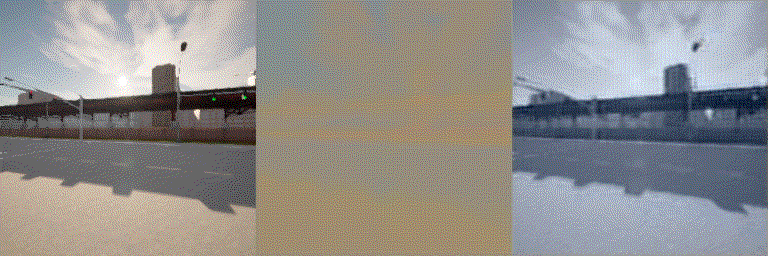

# Code and examples for Master Thesis

## Examples

### Reconstructions with Hierarchical VQVAE
16 256x256 frames in 10 FPS decoded and encoded.
Assuming 8-bit color channels, 3x16x256x256x8 is encoded into 4x32x32 + 8x32x32, which is a 98.8% reduction.

  
   

  
   

The lower dimensioned top encoding takes care of more general and global features, like coloring. The higher dimensioned bottom encoding takes care of more detailed features. Here, the input (left) is decoded first using only the top encoding (middle), then by the bottom encoding (right).

  

