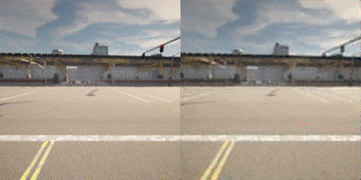

# Code and examples for Master Thesis

## Missing:
### Training bottom PixelSNAIL

## Implementations
Implementations of VQVAE and PixelSNAIL found in models directory.

lit_x.py models are models ported to PyTorch Lightning modules for training etc.

VQVAE: Hierarchical Quantized Autoencoders [https://arxiv.org/abs/2002.08111]

PixelSNAIL: An Improved Autoregressive Generative Model [https://arxiv.org/abs/1712.09763]

## Examples

### Reconstructions with Hierarchical VQVAE
16 256x256 frames in 10 FPS decoded and encoded.

Codebook size is 512, and assuming 8-bit color channels, 3x16x256x256x8 is encoded into 4x32x32xlog(512) + 8x32x32xlog(512), which is a 98.8% reduction.

  
   

  
   

#### Reconstruction using only top/bottom encoding

The lower dimensioned top encoding takes care of more general and global features, like coloring. The higher dimensioned bottom encoding takes care of more detailed features. Here, the input (left) is decoded first using only the top encoding (middle), then by the bottom encoding (right).

  

### PixelSNAIL
#### Top PixelSNAIL
Example showing ancestral sampling conditioned on 8 frames. 8 new frames are generated. Left is decoded from original encoding, middle is decoded from the generated top encoding and right is encoded from the generated top encoding and the bottom encoding (not generated!)

  

This example shows a converged 34M parameter model, compared to the 50M parameters above. Here, the generated frames are simply static frames equal to the last conditioning frame.

  

